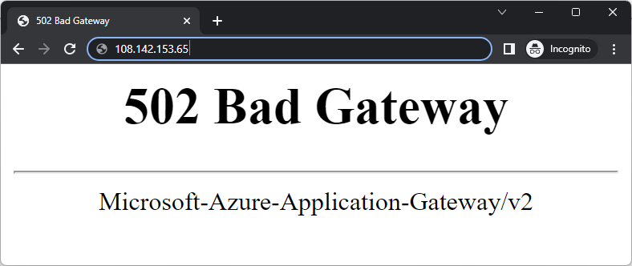
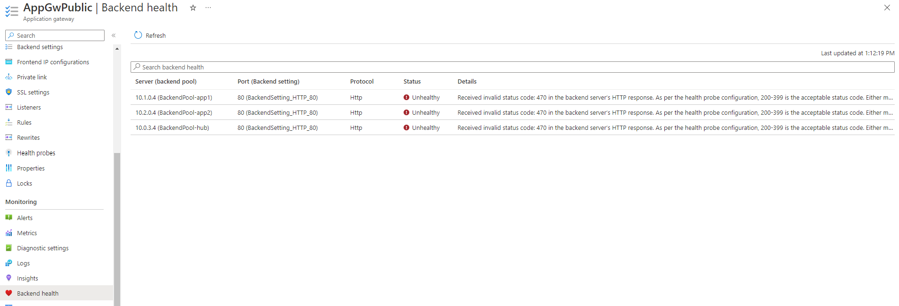
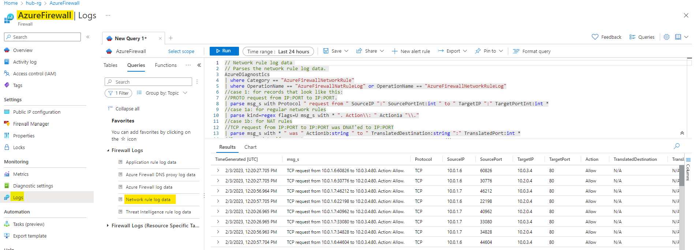

### [<< BACK TO THE MAIN MENU](https://github.com/nholuongut/azure-application-gateway-microhack)

# Scenario #4: Inspect traffic with Azure Firewall

## Overview

In this scenario, inbound web traffic goes through both Application Gateway (with WAF) Azure Firewall:

Advantages:
* The WAF provides protection at web application layer
* Azure Firewall acts a central logging and control point
* Azure Firewall inspects traffic between the Application Gateway and the backend servers

This scenario is deeply documented [here](https://learn.microsoft.com/en-us/azure/architecture/example-scenario/gateway/firewall-application-gateway#application-gateway-before-firewall).

> Note: This is also possible to put [Azure Firewall in front of Application Gateway](https://learn.microsoft.com/en-us/azure/architecture/example-scenario/gateway/firewall-application-gateway#application-gateway-after-firewall). This scenario is not covered in this MicroHack.

## Task 1: Configure symmetric routing 

To inspect traffic between Application Gateway and backend servers, Route Tables with User Defined Routes must be configured:

It is important to keep a symmetrical routing, otherwise traffic will be dropped.

1) **Create** and configure Route table `hub-snet-appgw-public-rt` in `hub-rg`:

This Route Table must be associated to `hub-vnet/snet-appgw-public` subnet.

2) **Create** and configure Route table `hub-snet-workload-rt` in `hub-rg`:

This Route Table must be associated to `hub-vnet/snet-workload` subnet.

3) **Create** and configure Route table `app1-snet-workload-rt` in `app1-rg`:

This Route Table must be associated to `app1-vnet/snet-workload` subnet.

4) **Create** and configure Route table `app2-snet-workload-rt` in `app2-rg`:

This Route Table must be associated to `app2-vnet/snet-workload` subnet.

--------

Symmetric routing for traffic between Application Gateway and backend servers is now configured.

Let's continue with the Azure Firewall configuration

## Task 2: Check it doesn't work

If you try to navigate to one of Public Listeners (http://108.142.153.65/ or http://app1-108.142.153.65.nip.io/ or http://app2-108.142.153.65.nip.io/), the following error appears: 

Navigate to Application Gateway => Monitoring => Backend health:

We observe that even if traffic routing is symmetric, Application Gateway receives **`invalid status code: 470`**.

Well, we need create rules, in Azure Firewall, to allow the traffic between Application Gateway and backend servers 😀.

## Task 3: Configure Azure Firewall

1) Navigate to `AzureFirewallPolicy` => Network rules.

2) **Create** below network rules:

## Task 4: Check it works

Try again to navigate to one of Public Listeners (http://108.142.153.65/ or http://app1-108.142.153.65.nip.io/ or http://app2-108.142.153.65.nip.io/), this is working again:

Application Gateway Backend health is healthy again also:

## Task 5: Review Azure Firewall logs

To observe traffic between Application Gateway and backend servers, navigate to Azure Firewall => Monitoring => Logs and execute below query :

> Note: Logs may take a while sometimes to arrive.

In the current configuration, Azure Firewall will inspect flows that the WAF has already allowed only.

If you are using Azure Firewall Premium, we could enable [IDPS](https://learn.microsoft.com/en-us/azure/firewall/premium-features#idps) feature: it will verify that the HTTP Host header matches the destination IP

## 🏁 Results

You should now be more familial with chaning Azure Application Gateway and Azure Firewall.

The routing part is obvisouly the most tricky: we need to ensure that the traffic is symmetric.

> **Important:** Default Route `0.0.0.0/0` cannot be used on [Application Gateway subnet](https://learn.microsoft.com/en-us/azure/application-gateway/configuration-infrastructure#supported-user-defined-routes).

Let's now expose websites with HTTPS!

### [>> GO TO SCENARIO #5](https://github.com/nholuongut/azure-application-gateway-microhack/blob/main/5-scenario.md)